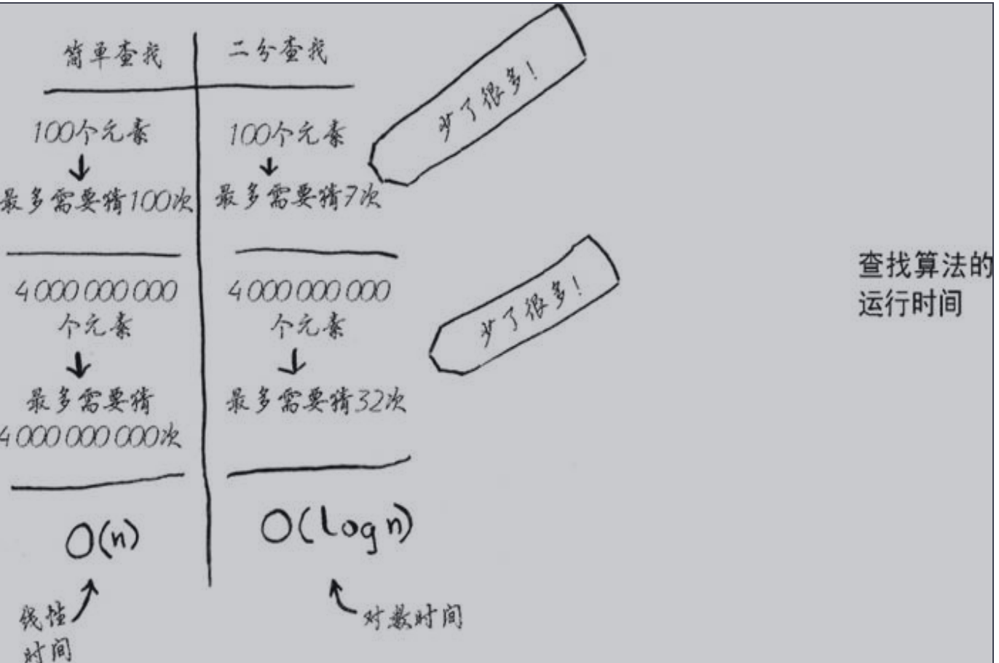
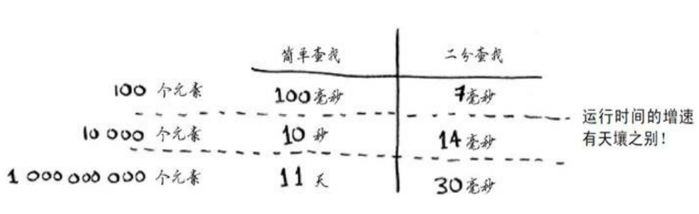
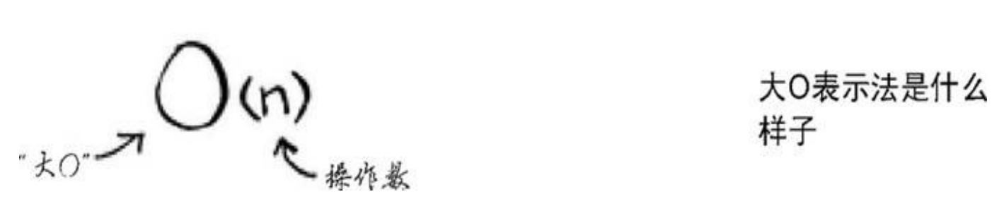
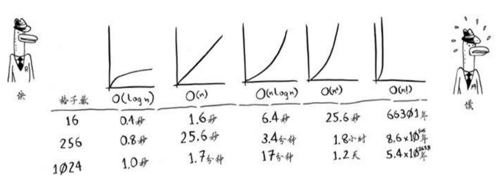
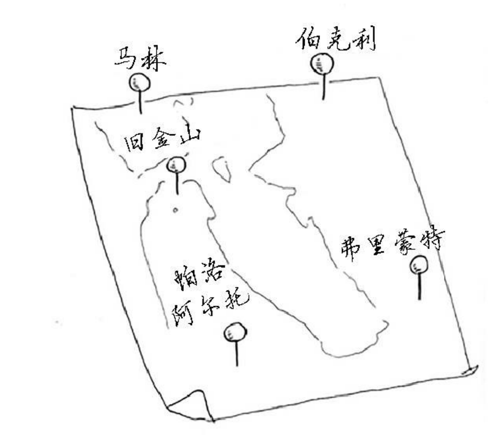
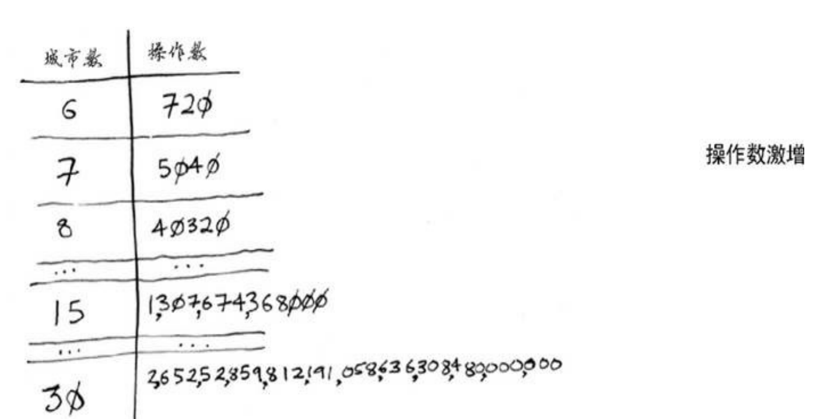

# 1.1 引言

**算法** 一组完成任务的指令。任何代码片段都可视为算法。

## 1.1.1 性能方面

### 1.1.2 问题解决技巧

# 1.2 二分查找

案例1: 在电话簿中寻找 K 开头的名字。

可以从头开始找，但如果按照字母顺序，K 应该在中间。

案例2: 在字典中寻找以 O 开头的字母时，也是从中间开始。

上述问题可以使用 二分查找 来解决。

二分查找的输入：一个有序的元素列表。如果要查找的元素位于列表中，则返回该元素的位置，否则返回 null

案例：在 1-100 中，查找数字 99。

简单查找，从 1 开始查找，即从 1 找到 99

## 1.2.1 更佳的查找方式

从 50 开始查找。

第一次查找：50，范围：1-100。结果：小了

第二次查找：75，范围：51-100。结果：小了

第三次查找：88，范围：76-100。结果：小了

第四次查找：94，范围：89-100。结果：小了

第五次查找：95，范围：90-100。结果：小了

第六次查找：98，范围：96-100。结果：小了

第七次查找：99，范围：99-100。结果：OK

一般而言，对于包含 n 个元素的列表，二分查找最多需要 log2 n(这里指 2 为底 n 的对数，因为输入的原因，暂时这样写) 步，而简单查找则最多需要 n 步。

二分查找针对有序的数据集合，每次将被查找的元素与中间元素对比，将查找的区域缩小为之前的一半，直到找到需要的元素，或者查找区间缩小为 0。

二分法的 JS 描述案例：这里针对的是简单的情况，输入的数据有序（升序？？），且没有重复的元素。

```javascript
function binarySearch(list, item) {
    let begin = 0
    let end = list.length - 1
    while (begin <= end) {
        const middleIndex = Math.floor((begin + end) / 2)
        const middleItem = list[middleIndex]
        switch (true) {
            case item < middleItem: // 如果 item 小于 middleItem,则 end 变小
                 end = middleIndex - 1
                 break
            case item > middleItem: // 如果 item 大于 middleItem,则 begin 变大
                 begin = middleIndex + 1
                 break
            default:
                return [middleIndex, middleItem] // 如果 item 等于 middleItem,则返回 middleItem 及 middleIndex
        }
    }
    return [-1, -1] // 没有找到，则返回 -1，-1，这里的返回值，是我自己定义的，也可以是返回元素在列表中的索引之类的
}
```

## 1.2.2 运行时间

一般而言，应选择效率最高的算法，以最大限度地减少运行时间和占用空间。

简单查找：假设列表 n 个数字，则最多需要猜 n 次。即最多需要猜测的次数和列表长度相同，这被称为线性时间。（linear time）

二分查找：二分查找的运行时间称为对数时间（或 log 时间）



# 1.3 大 O 表示法

大 O 表示法：一种特殊的表示法，指出了算法的速度有多快。

## 1.3.1 算法的运行时间以不同的速度增加

简单查找 和 二分查找，两种算法的运行时间呈现不同的增速。



仅仅知道算法需要多长时间才能运行完毕是不够的，还需要知道运行时间如何随列表增长而增加。这就是大 O 表示法的用武之地。

简单查找需要检查列表中的每个元素，因此可能需要执行 n 次操作。大 O 表示法即为 O(n)。但是，这样的表示是没有秒这样的单位之类的。大 O 表示法，指的并非是以 xxx 为单位的速度。大 O 表示法能够比较操作数，指出了算法运行时间的增速。

长度为 n 的列表，二分查找法，用大 O 法表示：O(logn),这里的 log 代表的是以 2 为底。



## 1.3.2 理解不同的大 O 运行时间

## 1.3.3 大 O 表示法指出了最糟糕情况下的运行时间

## 1.3.4 一些常见的大 O 运行时间

以下是从快到慢的顺序排列的 5 种大 O 运行时间

* O(log n),对数时间，这样的算法比如：二分查找
* O(n),线性时间，这样的算法比如：简单查找
* O(n*log n),这样的算法比如：快速排序
* O(n*n),这样的算法比如：选择排序，一种速度较慢的排序算法
* O(n!),这样的算法比如：旅行商问题，一种非常慢的算法

假设绘制包含 n 个格子的网格，使用上面的  5 种算法，假设每秒能执行 10 次操作，即 0.1 秒一次操作。



实际上，不能如此干脆利落的将大 O 运行时间转换为操作数，但就目前而言，这种准确度足够了。

总结：

* 算法的速度指的并非时间，而是操作数的增速。
* 谈论算法的速度时，我们说的是随着输入的增加，其运行时间将以什么样的速度增加。
* 算法的运行时间用大 O 表示法表示。
* O(log n) 比 O(n) 快，当需要搜索的元素越多时，前者比后者快的多。

## 1.3.5 旅行商问题



假设这位旅行商 A 要去往这 5 座城市，同时确保旅程最短。请考虑前往这些城市的可能顺序。

5 个城市，有 120 种不同的路线方式。城市数递增时，路线方式也在快速增加。



因此，涉及到 n 个城市时，需要执行 n! 次操作。运行时间为 O(n!)。

