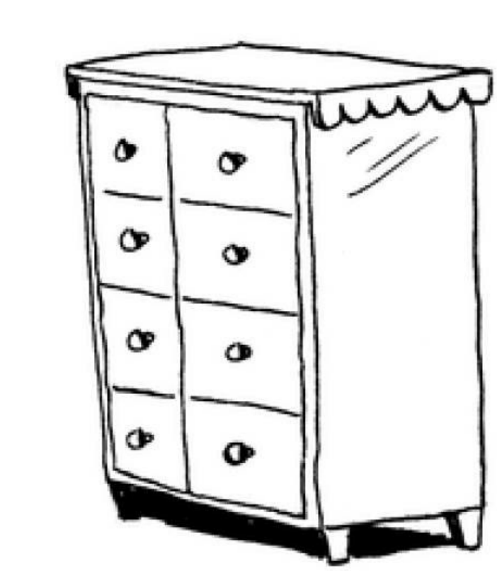
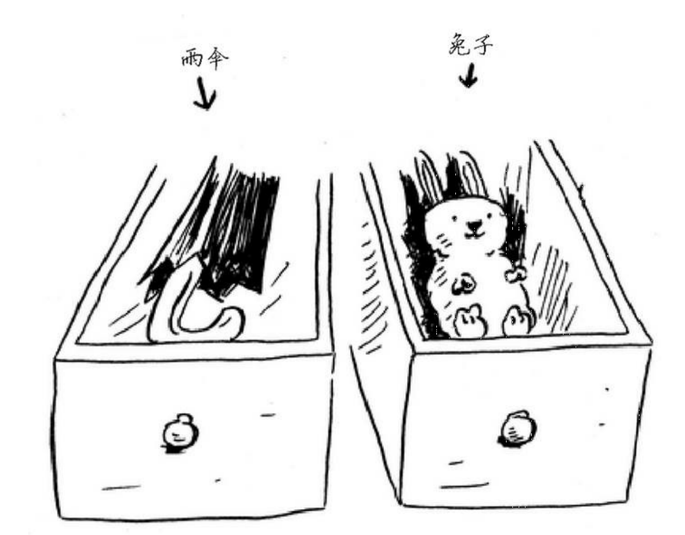
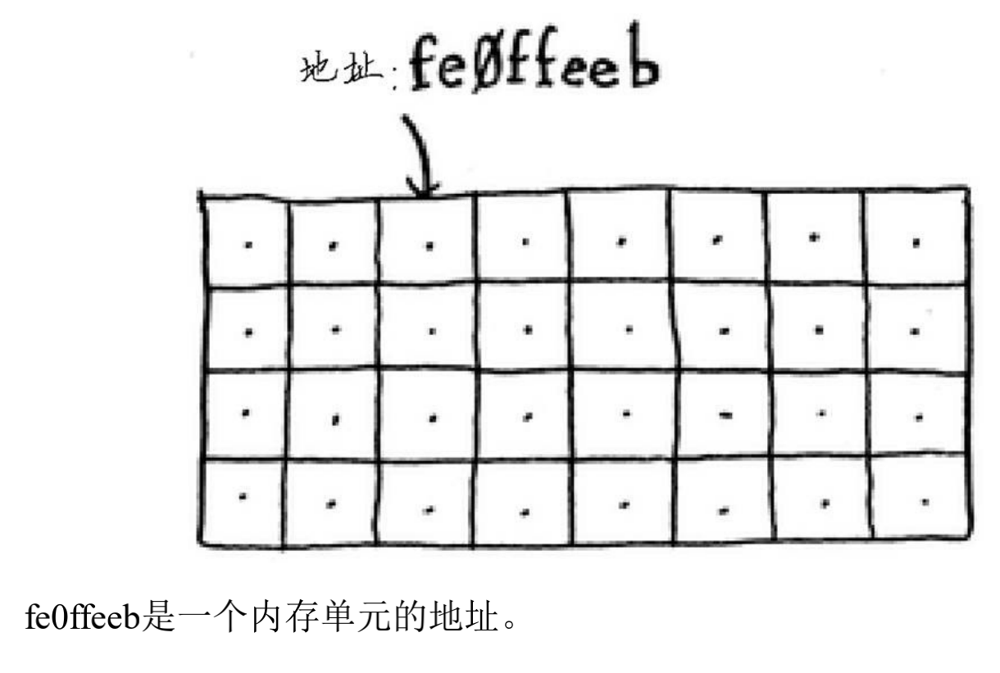
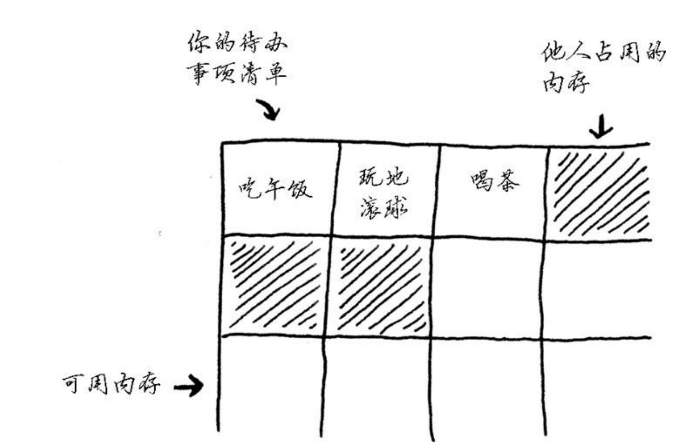
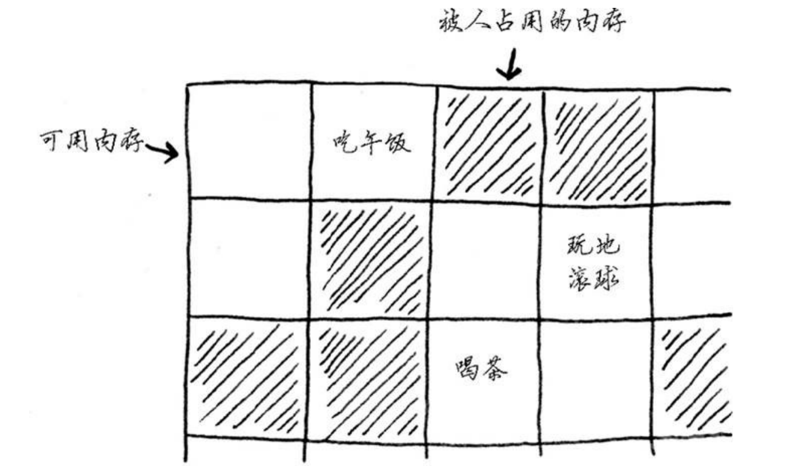
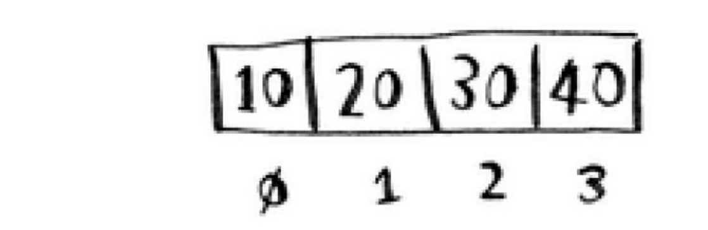
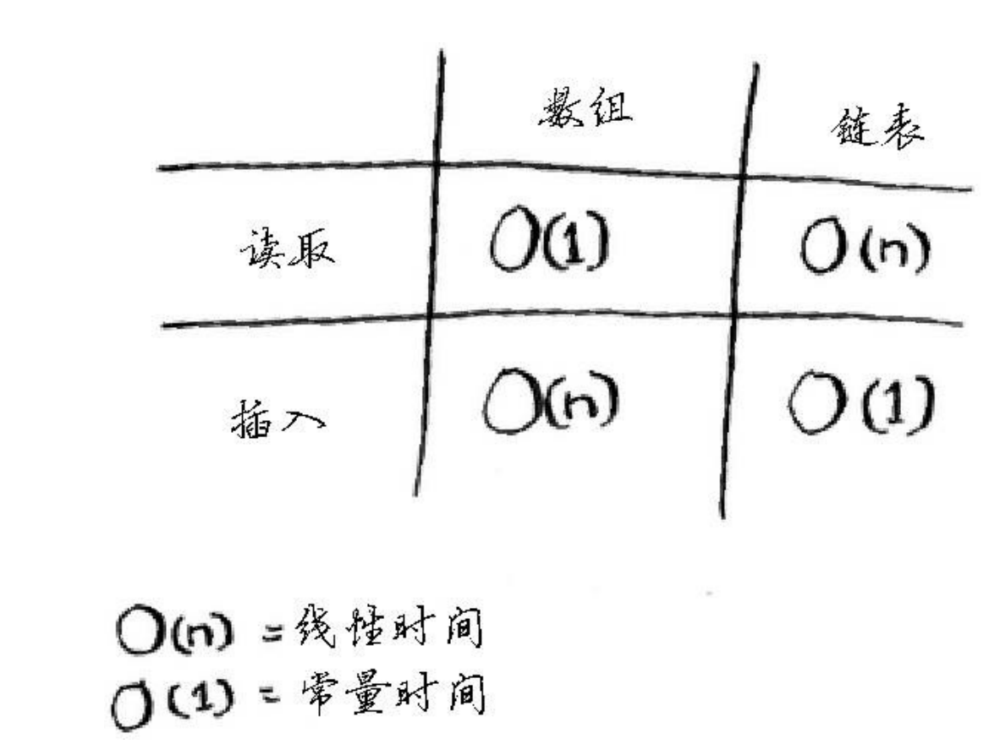

# 第 2 章 选择排序

## 2.1 内存的工作原理

假设 A 去看演出，需要将东西存在寄存处的柜子里。

每个格子存一样东西，A 有两样东西，因此存了两个格子。

这大概就是计算机内存的工作原理，计算机内存就像是很多个格子的集合体，每个格子都有单独的地址。

需要将数据存储到内存时，请求计算机分配存储空间，计算机给一个存储地址。存储多项数据时，有两种基本的存储方式--数组和链表。

数组和链表并非适合所有的情形，因此，知道它们的差别很重要。

## 2.2 数组和链表

假设 A 需要将代办事项存储在计算机中。

先使用数组来存储。使用数组意味着，每一个事项在内存中都是相连的。

假设 A 需要添加第四个待办事项，但 喝茶 末尾的格子已经被占用了。因此需要计算机分配一个新的内存空间，来存储有四个待办项的数据。

因此，在数组中添加新数据可能是很麻烦的，如果没有了空间，就需要移到内存中的其他地方去。速度可能就很慢。

可以预留位置来解决，例如，一开始就假设需要 10 个格子，但是这样有两个缺点：

* 10 个格子可能用不完，浪费空间
* 10 个格子不够，需要开辟新的空间

这种方法在一定程度上解决了问题，但是不够完美。这样的情况应该使用链表来解决。

### 2.2.1 链表

链表中的元素可以存储在内存中的任何地方。

链表中的每个元素都存储了下一个元素的地址。存储链表时，不需要将链表中的元素存储在相邻的位置。

因此，链表在插入元素方面具有比较大的优势。

### 2.2.2 数组

还是先说链表吧。读取链表最后一个元素时，是不能直接读取的。需要从第一个元素开始读取，获得第二个元素的位置，以此类推，直到读取到最后一个元素。或者说，读取任意一个元素，都是如此，都需要从第一个元素开始读取。因此，链表在读取方面的效率是比较低的。

数组则不一样，数组中的每个元素的地址都是可知的。或者说，只要知道第一个元素的位置即可，其他位置的元素可以通过 加法 运算出来。因此， 数组在随机读取元素方面具有较高的效率。

### 2.2.3 术语

数组元素带编号，编号从 0 开始。

元素的位置称为索引。

下图是数组和链表的常见操作的运行时间。

### 2.2.4 在中间插入

